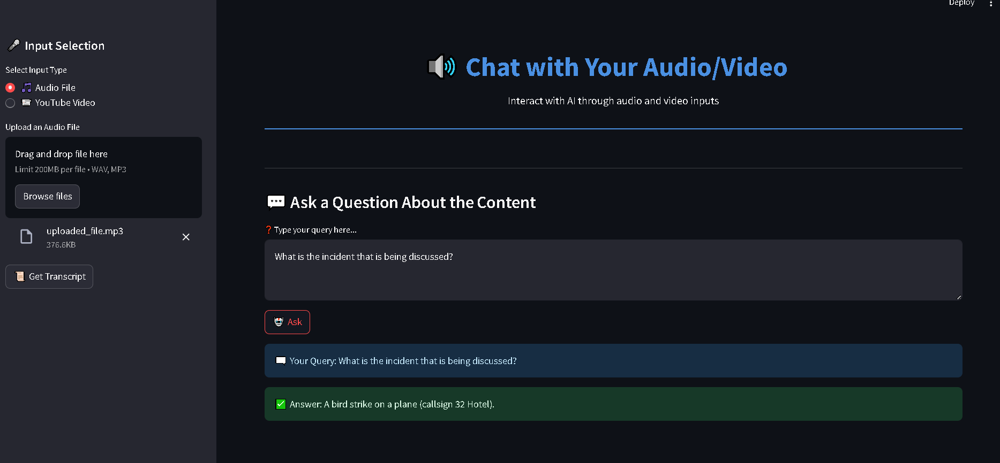
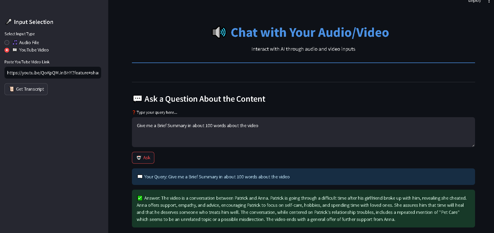

# ChatAudio: Interactive Audio/Video Chat with Transcription




## Overview
ChatAudio is an interactive application that allows users to chat with the content of audio files or YouTube videos. The app extracts the transcript from an audio file or a YouTube video and then provides a question-answering interface to query the content. It uses AssemblyAI for speech-to-text transcription, Google Gemini for embedding, and LangChain for Q&A functionality.

## Features
- Upload audio files or provide YouTube video URLs.
- Automatically transcribe the uploaded content or video using AssemblyAI and YouTube's transcript API.
- Split transcripts into chunks and store them in a vector database.
- Ask questions based on the transcripted content and receive answers.
- Visual enhancements using Lottie animations.
- Built with Streamlit for a user-friendly interface.

## Prerequisites

To run the app locally, you need to have Python 3.7 or higher installed on your machine.

### Setup and Installation

1. Clone this repository:
   ```bash
   git clone https://github.com/PriyanshuDey23/AVChatPro.git
   cd ChatAudio
   ```

2. Install the dependencies:
   ```bash
   pip install -r requirements.txt
   ```

3. Create a `.env` file in the project root and add your API keys:
   ```
   ASSEMBLY_API_KEY=your_assembly_api_key
   GOOGLE_API_KEY=your_google_api_key
   ```

4. Run the Streamlit app:
   ```bash
   streamlit run app.py
   ```

## How to Use

1. Select the input type: either "Audio File" or "YouTube Video".
2. Upload an audio file (MP3 or WAV) or enter the YouTube video URL.
3. Click "Get the Transcript" to transcribe the content.
4. Ask questions related to the content, and get answers based on the transcript.

## APIs Used

- [AssemblyAI](https://www.assemblyai.com/) for speech-to-text transcription.
- [YouTube Transcript API](https://pypi.org/project/youtube-transcript-api/) for extracting YouTube video transcripts.
- [Google Gemini](https://cloud.google.com/vertex-ai) for language embeddings.
- [LangChain](https://www.langchain.com/) for question-answering chain.

## License

This project is licensed under the MIT License.


